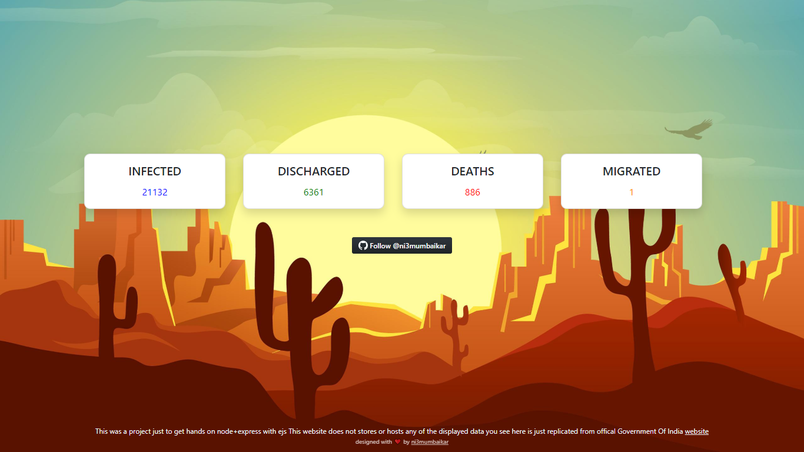

# Novel-Corona-India
This project represents live counts of patients across India. It uses node.js, express,js and ejs.  
Express basically sets the server up or in listening mode to get http requests and reponse with ejs file. 
  
Click [here](https://arcane-harbor-27723.herokuapp.com/covid-19-india) to launch demo of this web app.
  
## Getting started  
To get this code in your machine open terminal in newly created folder where you want these files to be stored  
  
``` git clone https://github.com/ni3mumbaikar/Novel-Corona-India.git ```  

To run the project
  
```node index.js```
  
## Screenshot  
  
  
:warning: Image values are outdated check again on [MyGov](https://mygov.in/covid-19) 

#### Safeguard Text : )
*The website neither hosts data being displayed nor stores somewhere else.
Values are directly replicated/scraped from [MyGov](https://mygov.in/covid-19) which is an authentic source of public information in India.
I would like to mention these 4 types of patients details is the only 
data that it collects which comes under public information.
The project was only made for educational purpose I do not support web scraping of private data.*
